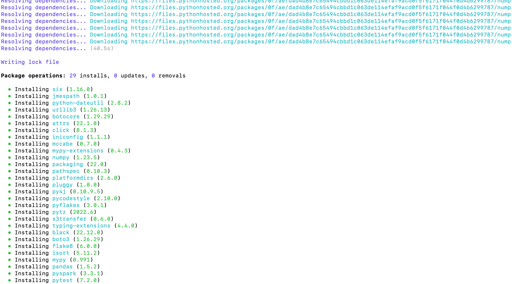
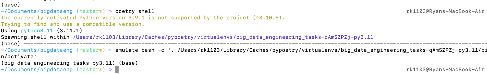

# Big Data Engineering Tasks

The `src` folder contains tasks 1,2 and 3 which contain `README.md` with descriptions on
the tasks and solution:

* src/task1/README.md
* src/task2/README.md
* src/task3/README.md

### Setting up the environment

If running the scripts locally, we will install poetry and configure virtual environment for
dependencies.  This will install the dependencies with the same versions as specified in the poetry.lock file
A python version above 3.8.1 or less than 3.10 is required.

```
pip install --upgrade pip
pip install poetry -U
poetry install
```



To activate the environment, run `poetry shell`



Further instructions can be found in the poetry documentation https://python-poetry.org/docs/basic-usage/.

Alternatively, the required dependencies (non-dev) in `pyproject.toml` file can be installed via another env manager e.g.
venv https://docs.python.org/3/library/venv.html or conda https://rc-docs.northeastern.edu/en/latest/software/conda.html#creating-a-conda-virtual-environment-with-anaconda

