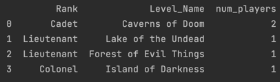

The `generate_data.py` script in the task1 folder generates simulated data for a fictional game, showing players
and the level that they’re currently playing. Find how many players of each rank are playing each level.

**Players Table**

| Player_ID | Player_Name | Rank | Level_ID |
| -- | --- | --- | --- |
| 13 | Raven | Cadet | 48 |
| 25 | CryHavoc | Lieutenant | 51 |
| 37 | oolala | Lieutenant | 17 |
| 443 | TheSquid | Colonel | 89 |
| 509 | meh | Cadet | 48 |
| ... | ... | ... | ... |


**Levels Table**

| Level_ID | Level_Name |
| -- | --- |
| 48 | Caverns of Doom |
| 51 | Lake of the Undead |
| 17 | Forest of Evil Things |
| 89 | Island of Darkness |
| ... | ... |


We can write a query as below which would join the `Players` and `Levels` tables on `Level_ID` and
then group by Rank and LevelName and then compute an aggregation (count) which would give the players
of each ran, playing each level.

```SQL
SELECT LevelName, Rank, count(*) as num_players
FROM Players
JOIN Levels ON (Players.Level_ID = Levels.Level_ID)
GROUP BY Rank,LevelName;
```

The query is incorrect for the following reasons:
* The column name is incorrect. It should be Level_Name and not LevelName. This will throw an error when executing the query
* The requirement is to show ` how many players of each rank are playing each level`. The query only groups by
Level_Name and has the Rank column in the select statement along with the aggregation. This is incorrect syntax
and will also throw an error. We need to group by Rank and Level_Name, and  select both these columns in the select
statement.

* The correct query is shown in the below

```SQL
SELECT Rank, Level_Name, count(*) as num_players \
FROM Players \
JOIN Levels ON (Players.Level_ID = Levels.Level_ID) \
GROUP BY Rank,Level_Name ;
```

This would join the Players and  Levels tables on Level_ID  and then group by Rank and LevelName and then
compute and aggregation (count) which would give the players of each  rank, playing each level.

The `execute_with_duckdb.py` script connects to an in memory database (duckdb as an alternative to sqllite)
and creates the required Players and Levels tables with few rows of data and then  executes the query shown in the
previous slide to output the result in a Pandas DataFrame.
Running this script will generate the following output to stdout. It also implements a check to ensure the
contents of the DataFrame are as expected.


