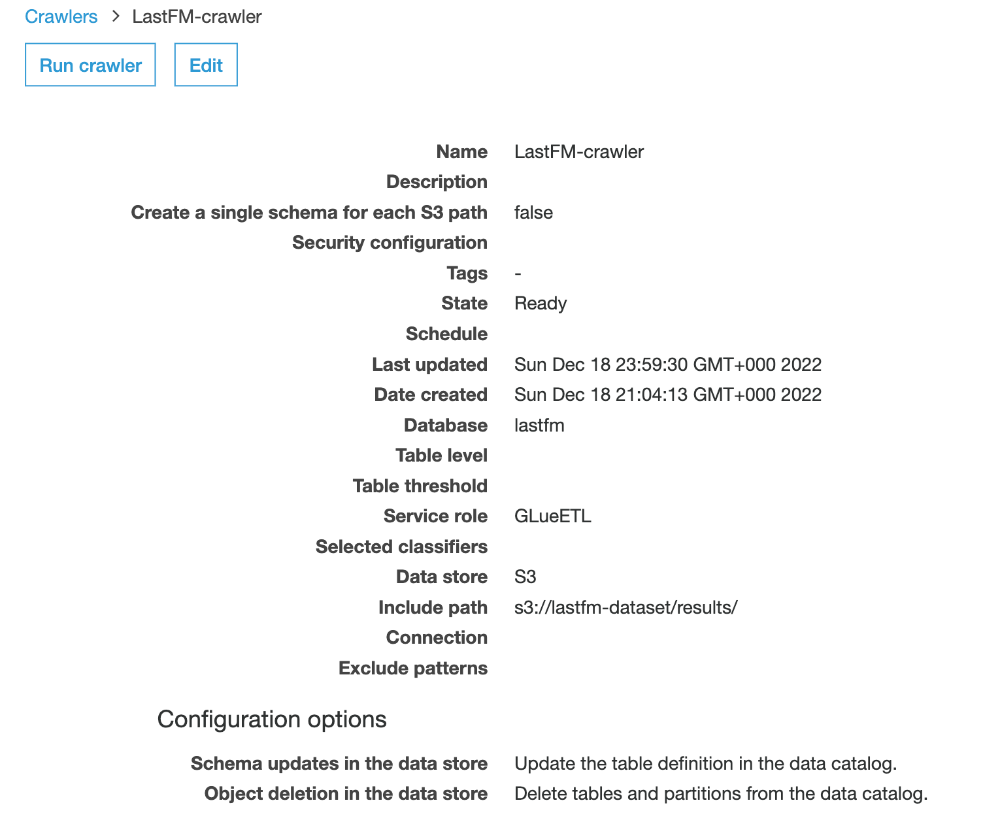

The script `main.py` carries out some analysis using spark on the dataset downloaded from Last.fm usage:
http://ocelma.net/MusicRecommendationDataset/lastfm-1K.html. This can be run end to
end by using the following commands from the root of the repository and making sure the virtual
environment is activated:

```
poetry shell
export PYTHONPATH=.
python src/task3/main.py
```

Using pyspark, create a spark session and optional configuration for executor and driver memory ( I have assigned 4gb
ram to avoid memory spill over errors). Then we read in the data using predefined schema structure
(timestamp column needs to be timestamp type) and only keep the columns we need.


DataFrames which were used as inputs to downstream transformations were cached. This is to avoid recomputing
the entire dag from the start, in case we want to re-run just a single transformation and show the dataframe
(an action would otherwise re-trigger the entire dag computation).
Repartition the DataFrame (number of partitions will depend on number of worker nodes and size of the dataset) to
optimize computation performance.

The script serialises dataframes in parquet format in `data\results`, for the following tasks:

* Create a list of user IDs, along with the number of distinct songs each user has played.

Function `create_users_and_distinct_songs_count` in `transformations.py` computes this using pyspark dataframe api to
select `userid`, `artistname`, `trackname` and drop duplicate rows. This will give distinct tracks per user.
Then  groupby `userid` and compute aggregate count over distinct tracks per user id.
A collect action will return all elements of each row in a list.
The aggregated dataframe is stored in parquet format in `data/results/distinct_songs.parquet`.


* Create a list of the 100 most popular songs (artist and title) in the dataset, with the number of times each was played.

Functon `create_popular_songs`  in `transformations.py` performs a Group By operation on the dataframe `artistname` and
`trackname` columns. We then compute aggregate count over tracks and then rrder in descending order of counts and
limit the number of rows to 100 to get the 100 most popular songs. Since the question asks for the results in a list,
we can perform a collect action to return all elements of each row in a list. The aggregated dataframe is stored in
parquet format in `data/results/popular_songs.parquet`.


* Say we define a user’s “session” of Last.fm usage to be comprised of one or more songs played by that user, where
each song is started within 20 minutes of the previous song’s start time. Create a list of the top 10 longest sessions
(by elapsed time), with the following information about each session: userid, timestamp of first and last songs in the
session, and the list of songs played in the session (in order of play).

Function `create_session_ids_for_all_users` in `transformations.py` performs the following steps
by calling other helper functions. We lag the previous timestamp for each user partition (using window function)
and compute the difference between current and previous timestamp in a session per user. We then create a session flag
(binary flag) for each user, if time between successive  played tracks exceeds session_cutoff (20 minutes).
A `SessionID` column will compute a cumulative sum over the `sessionflag` column for each user. The resultant
dataframe looks like below:


We then group the Spark DataFrame by user id and SessionID and compute min and
max timestamp as session start and end columns. Then create a session_length (hrs) column which  computes the
difference between session end and start for each row and convert to hours. Order the DataFrame from
max to min session length and limit to top 10 sessions as required.


To get the list of tracks for each session, join to the original raw dataframe read in and group by “userid",
"sessionID” and  "session_length” in hours. Now  apply the `pyspark.sql function` `collect_list` to
each group to create a list of tracks for each session.


The results show that `User_000949` was responsible for 6 of these 10 longest sessions.

## Running a Serverless Workflow on AWS

we can run the `main.py` script above and all the spark transformations and actions on
AWS Glue and query the results in Athena. The data can be copied into S3 buckets,
and orchestrate the execution of a glue job for reading the data from the bucket,
carrying out the transformations and writing the results to S3 destination key in parquet format
and then trigger a glue crawler to create or update tables with the metadata from the parquet files.
A successful job run, should then send an SNS notification to a user by email.


Create a standard bucket `lastfm-dataset`. Since some of these files are large, it is easier to
use the `aws s3` commands (such as `aws s3 cp`) for  uploading to the S3 bucket as this will
automatically use multipart upload feature if the file size  exceeds 100MB. We can also use
S3 transfer acceleration to optimise transfer speed, by enabling  transfer acceleration on the
bucket and using the s3-endpoint `s3-accelerate.amazonaws.com`
https://docs.aws.amazon.com/AmazonS3/latest/userguide/transfer-acceleration.html


We can setup the glue crawler https://docs.aws.amazon.com/glue/latest/dg/crawler-configuration.html to
include the settings in the screenshot below to collect metadata from the parquet files in S3 which
would be ouptut from the glue job, and update the catalog tables.




We will then create a glue job from the console by following the instructions in
https://docs.aws.amazon.com/glue/latest/ug/creating-jobs-chapter.html and uploading the
notebook in `notebooks/AWS_Glue_Notebook.ipynb`, which is a slight adaption of the code
in this package, to work with Glue (we use `GlueContext` and `DynamicDataFrame` in some
tasks)

Finally we will orchestrate the entire workflow using step function job which
can be created from `aws/step_function_def.json` definition file. *Note*: The a value of
parameter "TopicArn" in the "SNS Publish Success" state, has been masked to hide my accountid.
The correct arn would also include the region and accountid, otherwise an error will be thrown.


If the glue job is successful, we should see the parquet files in dedicated subfolders in
the results folder in the S3 bucket.


The catalog tables should be created after  successful completion of the crawler.
We can now query the tables in Athena as below. The tables could also be accessed via Amazon
Quicksight or Tableau for generating visualisation dashboards for further insights.


